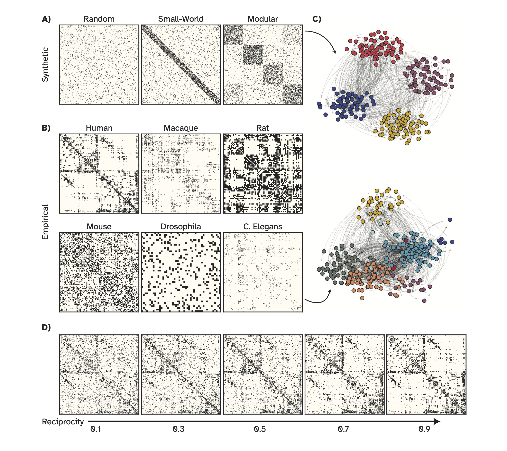

# NRC binary and weighted Network Reciprocity Control

This repository contains the source code for implementing the Network Reciprocity Control (NRC) algorithms, as introduced in the accompanying manuscript. The NRC algorithms allow for controlling the degree of asymmetry and reciprocity in both binary and weighted networks while preserving key network properties.

## Abstract
We introduce efficient Network Reciprocity Control (NRC) algorithms for steering the degree of asymmetry and reciprocity in binary and weighted networks while maintaining essential network properties. These algorithms adjust the asymmetry-reciprocity balance in networks under constraints such as edge density in binary networks and cumulative edge weight in weighted graphs. We test these methods on a range of synthetic benchmark networks—including random, small-world, and modular networks—as well as real-world brain connectivity maps (connectomes) from various species.

The NRC algorithms offer insights into how altering the asymmetry-reciprocity balance influences important network characteristics, including spectral properties, degree distributions, community structure, clustering, and path lengths. Additionally, the repository includes a case study where graded reciprocity is applied to a memory task within a reservoir computing framework, showcasing the computational implications of these methods. We also demonstrate the scalability of the NRC algorithms on networks of increasing size.

These approaches are valuable for systematically exploring the relationship between directional asymmetry and network topology. The algorithms have applications in computational and network sciences, social network analysis, and any domain that studies complex networks where directionality of connections is crucial.

## Features

- **Network Reciprocity Control**: Efficient algorithms to control reciprocity and asymmetry in binary and weighted networks.
- **Benchmark Networks**: Tested on synthetic networks (random, small-world, modular) and real-world brain connectomes.
- **Key Network Properties**: Preserves edge density, cumulative edge weight, and allows investigation of spectral properties, degree distributions, community structure, clustering, and path lengths, and performance of recurrent neural networks (RNNs).
- **Scalability**: Demonstrates performance on large-scale networks, ensuring computational efficiency.
- **Case Study**: Analyzes graded reciprocity's role in a memory task using a reservoir computing framework.



## Installation

To run the NRC algorithms, clone this repository and install the required dependencies.

git clone https://github.com/your-username/nrc-algorithms.git
cd nrc-algorithms

Ensure that you have Python 3.x and the following libraries installed:
pip install -r requirements.txt

Note that the plots were made by an in-house python package called `pyvizman`, which you can install using the command `pip install vizman==0.2.0`. This library is not included in the requirements file since it is not essential for the algorithm.

## Usage
The `utils` script contains functions for adjusting and computing reciprocity in binary networks. Below are the main functions and how to use them:

### 1. **Adjust Reciprocity in Binary Network**:

To adjust the reciprocity in a binary network, use the `adjust_reciprocity_binary` function from the `utils` module. This function takes two arguments: the adjacency matrix `W` (representing the network) and the `desired_reciprocity` value.

   #### Example:

   ```python
   import utils
   import numpy as np

   # Example binary network adjacency matrix 
   matrix = np.random.rand(64, 64)
   thresholded_matrix = (matrix > np.percentile(matrix, 90)).astype(int)
   
   # Set the desired reciprocity value
   desired_reciprocity = 0.5

   # Adjust reciprocity in the binary network
   W_adjusted = utils.adjust_reciprocity_binary(thresholded_matrix, desired_reciprocity)
   ```

To compute the reciprocity of a binary network, use the compute_reciprocity_binary function from the utils module. This function takes the adjacency matrix W as input and returns the computed reciprocity value.

```python
   import utils
   import numpy as np

   # Example binary network adjacency matrix 
   matrix = np.random.rand(64, 64)
   thresholded_matrix = (matrix > np.percentile(matrix, 90)).astype(int)

  reciprocity = utils.compute_reciprocity_binary(thresholded_matrix)
  print(f"Reciprocity: {reciprocity}")
```

### 2. **Adjust Reciprocity in Weighted Network**:

To adjust the reciprocity in a weighted network, use the `adjust_reciprocity_weighted` function from the `utils` module. This function takes two arguments: the adjacency matrix `W` (representing the network) and the `desired_reciprocity` value.

   Example:

   ```python
   import utils
   import numpy as np

  # Example binary network adjacency matrix W
   matrix = np.random.rand(64, 64)
   
   # Set the desired reciprocity value
   desired_reciprocity = 0.3

   # Adjust reciprocity in the weighted network
   W_adjusted = utils.adjust_reciprocity_weighted(matrix, desired_reciprocity)
```

To compute the weighted reciprocity of a network, use the compute_reciprocity_weighted function from the utils module. This function takes the adjacency matrix W as input and returns the computed reciprocity value.

```python
   import utils
   import numpy as np

   # Example binary network adjacency matrix
   matrix = np.random.rand(64, 64)

reciprocity = utils.compute_reciprocity_weighted(matrix)
print(f"Reciprocity: {reciprocity}")
```
## Benchmark Network Data:
[This Link](https://drive.google.com/drive/folders/1waakirfxdCtAQBhSoFbgi_WBuw-6Ms1p?usp=drive_link) includes synthetic networks used in this study plus their adjusted reciprocity. 
synthetic_mats.npy includes 50 trials of networks with random, small-world, and modular structure with 256 nodes. 
The data shape follows (num_nodes, num_nodes, n_trials, profile) where profile = [0, 1, 2] for [random, small-world, modular]

synthetic_mats_graded_reciprocity.npy includes adjacency matrices after adjusting binary reciprocity. 
The data shape follows (n_nodes, n_nodes, n_trials, profile, n_reciprocity) = (256, 256, 50, 3, 11)
11 adjusted reciprocity values are: [0, 0.1, 0.2, 0.3, 0.4, 0.5, 0.6, 0.7, 0.8, 0.9, 1.0]

weighted_synthetic_mats.npy includes syntetic weighted networks and weighted_synthetic_mats_graded_reciprocity.npy contains adjacency matrices after adjusting weighted reciprocity.

## Contributing
Contributions are welcome! If you find bugs, suggest improvements, or want to collaborate on new features, feel free to fork the repository, create an issue, or submit a pull request.


## Citation
If you use these algorithms in your research, please cite the corresponding manuscript:

Hadaeghi, Fatemeh, Kayson Fakhar, and Claus Christian Hilgetag. "Controlling Reciprocity in Binary and Weighted Networks: A Novel Density-Conserving Approach." bioRxiv (2024).
link: [https://www.biorxiv.org/content/10.1101/2024.11.24.625064v2]

